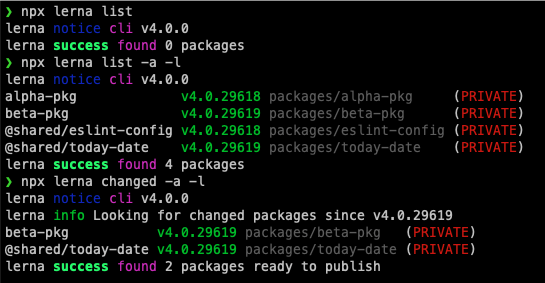

# Learner Lerna

Steps taken:

 
 
* [x] new NPM app
* [x] install lerna as Dev Dependency
* [x] git init
* [x] lerna init
* [x] lerna create 2 (private) app packages (eg alpha/beta) - in this case SPA/ViteJS/Vanilla React app should be fine
  * finding: running `npm lerna run start` from root will run every package's `npm start` script.
  * finding: `npx lerna run start --stream -- --silent` removes a lot (not all) of the logging noise
  * finding: `npx lerna publish` (once pushed to GH) will prompt for what version to bump to (minor/patch/major/alpha/etc)
  * finding: attempted to publish to npm despite being flagged as private. (failed as I wasn't logged into NPM)
  * finding: this was made to both alpha and beta packages
  * finding: running `npm lerna version` at this point returned nothing - "No changed packages to version"
* [x] make a change to just one package, push and version.
  * finding: `npx lerna version` will bump ALL packages to the latest.
  * finding: this versioning is unscope-able - the entire lerna package stack is versioned
  * finding: `npx lerna run start --since main` VERY interesting. will run start on the packages that have changed since the main branch
  * finding: `npx lerna changed -a -l` when on a branch will list the packages that would be subjects of the next `lerna version`
  * finding: standardising npm scripts eg: `npm run lint`, `npm run test` does allow for lerna to run a single command for all packages.
  * hypothesis: this seems key to understanding which packages (if any) need to be rebuilt/deployed.
  * question: if a package is a dependency (eg utility classes, or Piñata) - can a change to that dependency trigger a rebuild on all dependants?
* [x] lerna create a shared eslint configuration package that all other packages can use
  * created a @shared/eslint-config package - purely for sharing a config internally
  * added a lint script to each *-pkg package
  * added eslint to the same packages (internal dev dependencies only)
  * added an npm script to root that would call `lerna run lint` on all packages that can run that
* [x] lerna create a (private) "common" package (this idea is to import a file or 2 from here into alpha/beta)
* [x] for now keep all dependencies within each package (no hoisting)
* [x] ensure common is a dependency of alpha/beta
* [/] understand what lerna publish/version/changed

 

 
## Main takeaways

* shared packages are nice. appears that a naming convention of `@package/sub-package` makes things easier to reference one aother internally.
* `lerna publish` is not something we currently want to do.
* `lerna version patch` is something we want to do on every merge to master. [Other useful versioning commands](https://github.com/lerna/lerna/blob/main/commands/version/README.md)
* tagging/versioning in Lerna is EVERYTHING. We do this already, so no bad thing. Every deploy to main/master we patch version and add a git tag.
* with the tags we can do things like understand which packages have changed since the last tag, and only build those packages
* `npx lerna changed -a` is the magic sauce that provides us with a list of packages to care about each deploy
* in the case where a dependant package is changed, all packages that depend upon that are also listed as changed - so a PR that would affect Piñata would result in a redeploy of any packages that use it. This is a Good Thing.

## Interesting things

*  https://github.com/lerna/lerna#git-hosted-dependencies - could other repos also use lerna and reference other GH repos as a dependency (thinking pinata here)
